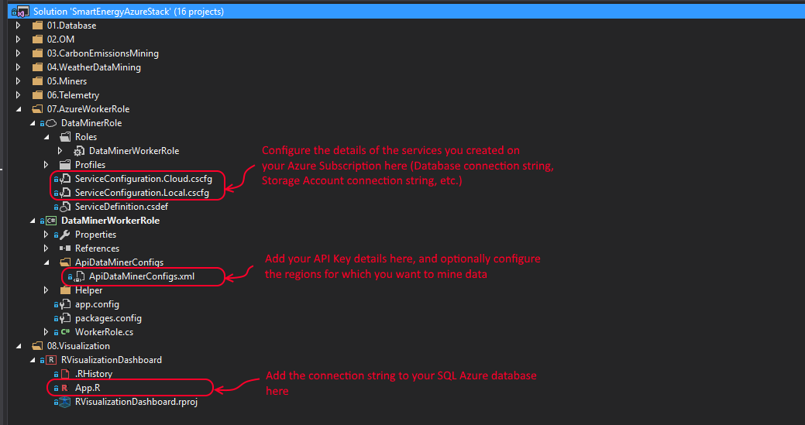
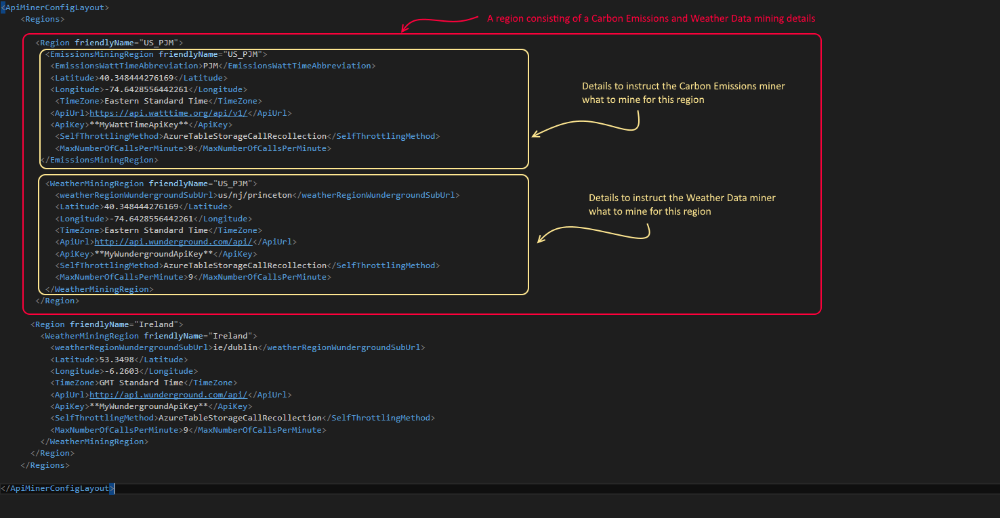
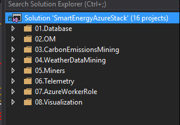

# Overview
Optimising energy consumption based on the real-time Marginal Emissions of an electricity market can substantially reduce the consumer's Carbon Emissions [[1](http://ieeexplore.ieee.org/document/6128960/?reload=true)]. 

This is a demonstration solution to show how data from several Web based APIs can be mined, visualised and acted upon in a Microsoft Azure solution. This solution collects real-time Carbon Emissions data from the WattTime API (https://api.watttime.org/), and global Weather data and weather forecasts from the Wunderground API (https://www.wunderground.com/). It then visualises this data over time to allow the user to understand the relationship between the two. It demonstrates the ability to collect related pieces of data into a single place to allow automation to act upon the conclusions extracted from it. For example, automating devices via the Azure IoT service to minimise net Carbon Emissions. 

A placeholder Data Miner is included, to allow for the addition of any other data sources to the solution. Hence, this stack can be extended for all sorts of uses, centred around energy efficiency and emissions, or otherwise. 

# Licenses
This code is licensed under the [MIT license](LICENSE.TXT).

# Creating the Infrastructure on Azure
To use this solution, users must first register for API keys with Wunderground and WattTIme. Both services have a certain amount of free usage allowed. The usage thresholds and commercial usage restrictions are outlined in the terms of use of both services and the user is responsible for adhering to these. 

Before deploying the solution to begin collecting data, you will need to create the infrastructure on your Azure subscription for it to run on. You will need:
1. A SQL Azure Database Server instance
2. A classic Azure Storage account, with a message queue created called "dataminerschedulerprod" (You  can create the queue using Visual Studio Cloud Explorer, or [Microsoft Azure Storage Explorer](http://storageexplorer.com/))
3. A Cloud Service
4. A Wunderground Weather Data API Key (register here: https://www.wunderground.com/weather/api/)
5. A WattTime Carbon Emissions Data API Key (register here: https://api.watttime.org/accounts/register/)

# Deploying the Solution
When you have created the infrastructure and registered for the API keys, the deployment steps are as follows:
1. Clone the code repository locally and open the solution in Visual Studio
2. Right click on the SmartEnergyDatabase project and click "Publish". Enter the details of your SQL Azure server and hit Publish. This will create the solution's database on your SQL Server, ready to accept data from the data miners. 
3. Add the details of your Azure infrastructure and API keys to the following configuration locations: 
	* 
		
	* Open the Cloud Service configuration file ServiceConfiguration.Cloud.cscfg and ServiceConfiguration.Local.cscfg under the DataMinerRole project and configure the details of the services you created in that file as such: 
		* 
		
	* Add your API keys for Wunderground and WattTime to the ApiDataMinerConfigs.xml file in the DataMinerWorkerRole project. Optionally, tailor the regions you want to mine weather and emissions data for in the ApiDataMinerConfigs.xml file. See section Configuring the Data Miner to see how to do this.
	Optionally, if you would like to run the individual methods using the Integration Tests method, update the app.config files in each Test project with the details of your services and API keys, A find and replace across the whole solution will do this quickly:
		* \*\*MyAzureSQLServerName\*\*: Replace with your SQL Azure Server Name
		* \*\*MyAzureSQLDatabaseName\*\*Replace with your SQL Azure Database Name
		* \*\*MyAzureSQLUserName\*\*Replace with your SQL Azure Username
		* \*\*MyAzureSQLPassword\*\*Replace with your SQL Azure Password
		* \*\*MyWattTimeApiKey\*\*Replace with your WattTime Api Key  (register here: https://api.watttime.org/accounts/register/)
		* \*\*MyWattTimeApiKey\*\*Replace with your Wunderground Api Key  (register here: https://www.wunderground.com/weather/api/)
		* \*\*MyAzureStorageAccountName\*\*Replace with your Azure Storage Account Name
		* \*\*MyAzureStorageAccountKey\*\*Replace with your Azure Storage Account Key
4. Right click on the DataMinerRole project and hit Publish. Sign into your subscription, and publish the role to the Cloud Service you created. 
5. To allow the Visualisation dashboard to visualise the data that the data miner has collected into your SQL Azure database, open App.R in the RVisualizationDashboard, and update the SQL Connection string to point to your SQL Azure database. Optionally, publish this R visualisation as a ShinyApp. 

# Configuring the Data Miner
The DataMinerRole reads where it should mine Weather and Emissions data from in the ApiDataMinerConfigs.xml file in the DataMinerWorkerRole project. The XML file contains a series of <Region> elements, comprised of a <EmissionsMiningRegion> and a <WeatherMiningRegion>. A Region element can have one or both. Configure the details  of a region as such: 
	* 
	

# Data Sources
## Weather Data
This solution calls the Wunderground API (https://www.wunderground.com/) to acquire weather data. The weather regions to mine are defined in the ApiDataMinerConfigs.xml file. 

When using this solution to retrieve data from the Wunderground API, you are bound by the terms of service and attribution requirements of the API. See them here: https://www.wunderground.com/weather/api/d/terms.html?MR=1 . Specifically, "In all uses of the API data, you will credit WUL by name and brand logo as the source of the API data"

## Carbon Emissions Data
This solution calls the WattTime API (https://api.watttime.org/) to acquire Carbon Emissions data. The Emissions regions to mine are defined in the ApiDataMinerConfigs.xml file. To see what regions are available to mine, see the WattTime API documentation: https://api.watttime.org/faq/

When using this solution to retrieve data from the WattTime API, you are bound by the terms of service and attribution requirements of the API. See them here: https://api.watttime.org/faq/

# Solution Layout
The solution is laid out in folders for each layer in the stack: 

* The Database Layer is a SQL Azure database
* The Object Model uses Entity Framework to provide access to the Database
* The CarbonEmissionsMining and WeatherDataMining projects provide access to the WattTIme and Wunderground APIs
* The Miners folder contains projects which call the CarbonEmissionsMining and WeatherDataMining projects to mine data from the WattTIme and Wunderground APIs
* The Telemetry layer provides a light weight telemetry system which logs system messages to Azure Table Storage
* The AzureWorkerRole listens to message on the message queue on the configured Storage Account and kicks off the data mining 
* The Visualisation layer displays the data in the SQL Azure database using a ShinyApp on the Microsoft R Open Enhanced R Distribution: https://mran.microsoft.com/open/
	

# Monitoring the Solution Once it's Deployed
The Miner Worker Roles automatically log their status as they operate to the SystemLogs table under the storage account configured for the solution. 

# Throttling Calls to the APIs
The solution has inbuilt throttling to ensure that it doesn't flood the APIs it's calling with requests. The maximum number of requests to make to each API is configured in the ApiDataMinerConfigs.xml file. The code () uses a table under the storage account configured for the solution to record each call to each API. An Azure Table is used to ensure the monitor the number of calls are not exceeded across both Azure-deployed and local debugging versions of the code. 

Before issuing any new call, the code checks this table to see how many calls have been issued in the last minute. If it has reached the limit of calls as configured in ApiDataMinerConfigs.xml, it will wait to issue the call until the number of calls in the last minute drops back below the maximum number specified. When this happens, you will see a line in the SystemLogs table indicating it: 

# Contributing
This project has adopted the [Microsoft Open Source Code of Conduct](https://opensource.microsoft.com/codeofconduct/). For more information see the [Code of Conduct FAQ](https://opensource.microsoft.com/codeofconduct/faq/) or contact [opencode@microsoft.com](mailto:opencode@microsoft.com) with any additional questions or comments.
