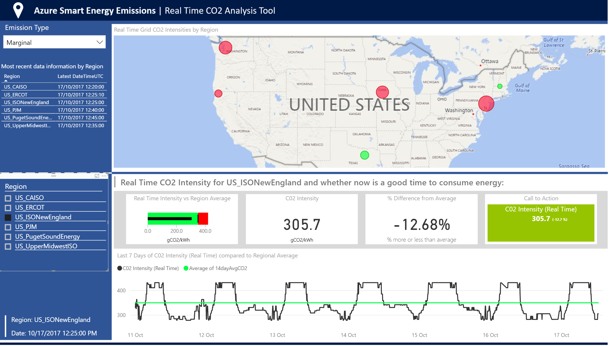
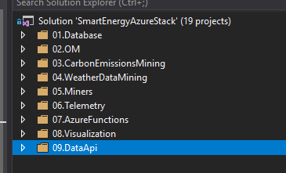
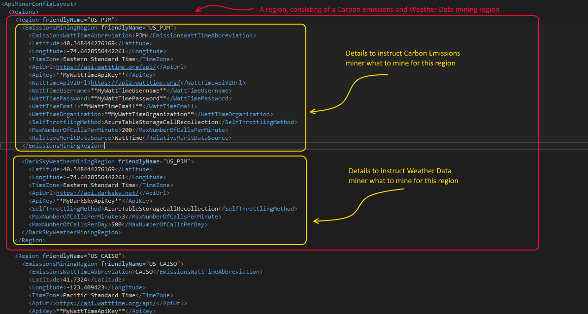
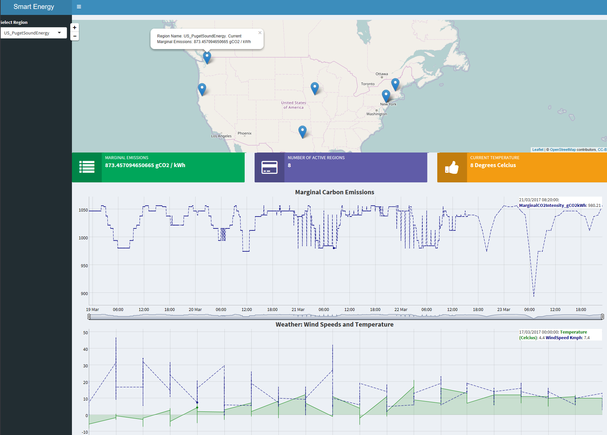
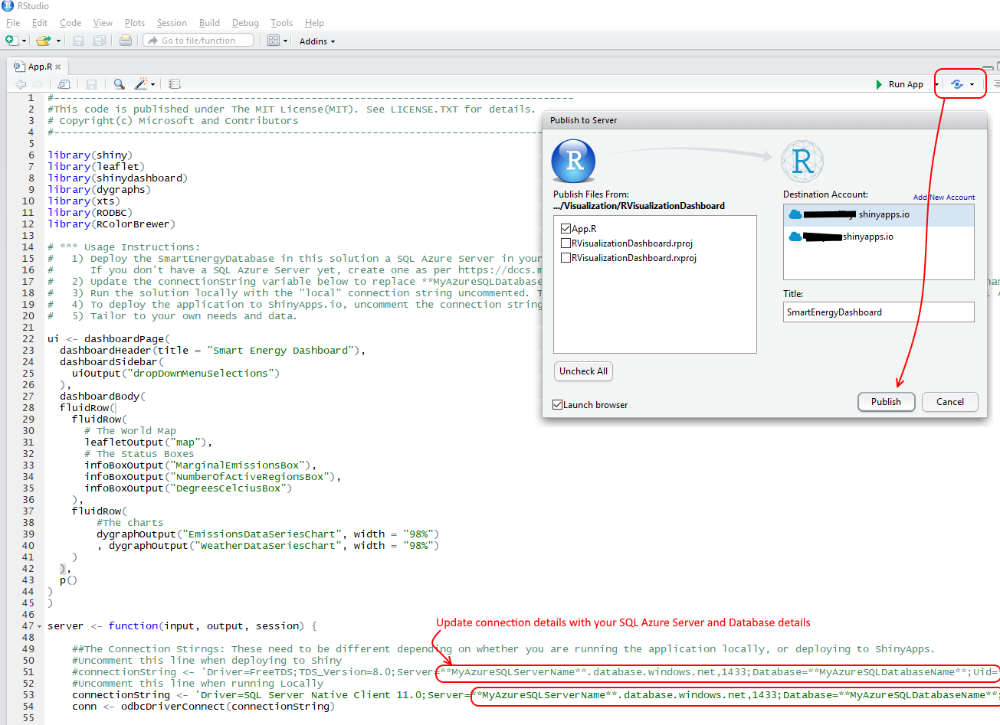

# Welcome to the Azure Carbon Emissions Data Platform
 <-- Click here to deploy the solution to your Azure subscription with a single click.

# Overview
Optimising energy consumption based on the real-time Marginal Emissions of an electricity market can substantially reduce the consumer's Carbon Emissions [[1](http://ieeexplore.ieee.org/document/6128960/?reload=true)]. 

This is a demonstration solution to show how data from several Web based APIs can be mined, visualised and acted upon in a Microsoft Azure solution. This solution collects real-time Carbon Emissions data from the WattTime API (https://api.watttime.org/), and global Weather data and weather forecasts from the Wunderground API (https://www.wunderground.com/). It then visualises this data over time to allow the user to understand the relationship between the two. It demonstrates the ability to collect related pieces of data into a single place to allow automation to act upon the conclusions extracted from it. For example, automating devices via the Azure IoT service to minimise net Carbon Emissions. 

A placeholder Data Miner is included, to allow for the addition of any other data sources to the solution. Hence, this stack can be extended for all sorts of uses, centred around energy efficiency and emissions, or otherwise. 

## Video
[Video](https://www.youtube.com/watch?v=5VjkwxCsWv4) with the background of this solution and it's potential applications. [Blog Post](https://blogs.microsoft.com/green/2017/06/21/beyond-energy-efficiency-using-the-power-of-data-to-find-the-cleanest-hours-of-the-day/) with further background. 

# Azure Subscription
To deploy this solution, you'll need an Azure subscription. You can sign up for a free Azure subscription to deploy this solution to at https://azure.microsoft.com/en-us/free . 

# Licenses
This code is licensed under the [MIT license](LICENSE).

# Prerequisites
To use this solution, users must first register for API keys with Wunderground and WattTime. Both services have a certain amount of free usage allowed. The usage thresholds and commercial usage restrictions are outlined in the terms of use of both services and the user is responsible for adhering to these. So the steps to getting started: 

1. If you don't already have it, download Visual Studio from https://www.visualstudio.com/
2. If you don't already have an Azure subscription, sign up for a free trial of Azure at https://azure.microsoft.com/en-us/free
2. Register for a WattTime Carbon Emissions Data API Key here: https://api.watttime.org/accounts/register/
3. Register for a Wunderground Weather Data API Key here: https://www.wunderground.com/weather/api/

# Deploying the Solution
You can deploy the solution automatically to your Azure Subscription [here](https://start.cortanaintelligence.com/Deployments/new/smartenergyemissions). That solution will automatically create the infrastructure on your Azure subscription. You can then customise the solution using the code in this project and deploy that updated version to update your running copy of the platform. 

# Customising the Solution and your Infrastructure
## Components
The solution uses the following components: 
* A SQL Azure Server and Database
* An Azure Storage account
* An Azure Function to create the database tables and initial seeded data
* An Azure Function that runs every 30 minutes, mining carbon emissions data from the pre-selected markets

## Customising the code
The solution is laid out in folders for each layer in the stack: 
 

* The Database Layer is a SQL Azure database
* The Object Model uses Entity Framework to provide access to the Database
* The CarbonEmissionsMining and WeatherDataMining projects provide access to the WattTIme and Wunderground APIs
* The Miners folder contains projects which call the CarbonEmissionsMining and WeatherDataMining projects to mine data from the WattTIme and Wunderground APIs
* The Telemetry layer provides a light weight telemetry system which logs system messages to Azure Table Storage
* The Azure Function mines the data on a schedule (every 30 minutes by default)
* The Visualisation layer displays the data in the SQL Azure database using a ShinyApp on the Microsoft R Open Enhanced R Distribution: https://mran.microsoft.com/open/
* The DataApi layer is a simple WebAPI which allows access to the stored data

# Configuring the Data Miner / Updating  the Regions Mined
### Customising the regions mined
The DataMinerFunction reads where it should mine Weather and Emissions data from in the ApiDataMinerConfigs.xml file in the DataMinerFunction project. The XML file contains a series of <Region> elements, comprised of a \<EmissionsMiningRegion\> and a \<WeatherMiningRegion\>. A Region element can have one or both. Configure the details  of a region as such: 
	* 

You can update the regions being mined in two places: 

A) Directly in the running Azure Function: 
1. Opening the Resource group in the Azure Portal
2. Hit the Azure Function and hit App Service Editor
3. You'll see the ApiDataMinerConfigs.xml files listed in the ApiDataMinerConfigs folder under the wwroot
4. You can update the content of the XML file and the updated contents will be picked up by the miner Azure Function the next time it runs. 

B) In the Visual Studio Solution: by updating the ApiDataMinerConfigs.xml XML file in the Azure Function project, before publishing the function to the Azure Function running on your Azure subscription

### GPS based weather data mining:
There are two options for mining weather data from the  Wunderground Service: 
	1. Using the suburl of the weather station you wise to mine (for example, us/nj/princeton to mine the data for Princeton New Jersey, located at https://www.wunderground.com/weather/us/nj/princeton on Wunderground). For this, set the <MiningMethod> attribute in to "WundergroundPageSubUrl" (as in \<MiningMethod\>WundergroundPageSubUrl\</MiningMethod\> )
	2. Based on GPS coordinates. In this case, the miner will first query Wunderground to locate the closest weather station to the GPS coordinates supplied, and then mine that weather station's weather data. There is the possibility that the weather station closest to the coordinates specified only records a subset of the full set of weather datapoints the major weather stations record. For this, set the <MiningMethod> attribute in to "GPS" (as in \<MiningMethod\>GPS\</MiningMethod\> )
	
# Data Sources
## Weather Data
This solution calls the Wunderground API (https://www.wunderground.com/) to acquire weather data. The weather regions to mine are defined in the ApiDataMinerConfigs.xml file. 
When using this solution to retrieve data from the Wunderground API, you are bound by the terms of service and attribution requirements of the API. See them here: https://www.wunderground.com/weather/api/d/terms.html?MR=1 . Specifically, "In all uses of the API data, you will credit WUL by name and brand logo as the source of the API data"
## Carbon Emissions Data
This solution calls the WattTime API (https://api.watttime.org/) to acquire Carbon Emissions data. The Emissions regions to mine are defined in the ApiDataMinerConfigs.xml file. To see what regions are available to mine, see the WattTime API documentation: https://api.watttime.org/faq/
When using this solution to retrieve data from the WattTime API, you are bound by the terms of service and attribution requirements of the API. See them here: https://api.watttime.org/faq/

# Monitoring the Solution Once it's Deployed
The Miner Worker Roles automatically log their status as they operate to the SystemLogs table under the storage account configured for the solution. 

# Throttling Calls to the APIs
The solution has inbuilt throttling to ensure that it doesn't flood the APIs it's calling with requests. The maximum number of requests to make to each API is configured in the ApiDataMinerConfigs.xml file. The code () uses a table under the storage account configured for the solution to record each call to each API. An Azure Table is used to ensure the monitor the number of calls are not exceeded across both Azure-deployed and local debugging versions of the code. 
Before issuing any new call, the code checks this table to see how many calls have been issued in the last minute. If it has reached the limit of calls as configured in ApiDataMinerConfigs.xml, it will wait to issue the call until the number of calls in the last minute drops back below the maximum number specified. When this happens, you will see a line in the SystemLogs table indicating it: 

### Updating the settings of the data miner Azure Function
If the solution is deployed from here, the Data Miner Azure Function is automatically configured with the connection details of your Azure SQL Server and Azure Storage Account. If you would like to view or update these settings, you can do so by opening the Resource group in the Azure Portal, hitting the Azure Function, hitting Application Settings. You'll see the setting like this: 

# Manually Creating the Infrastructure on Azure
You can deploy the solution automatically to your Azure Subscription [here](https://start.cortanaintelligence.com/Deployments/new/smartenergyemissions) and that will create all required infrastructure automatically. However, if you want to create the infrastructure and deploy it manually, you can with the following steps: First register for API keys with Wunderground and WattTIme. Both services have a certain amount of free usage allowed. The usage thresholds and commercial usage restrictions are outlined in the terms of use of both services and the user is responsible for adhering to these. 
Next, create the infrastructure on your Azure subscription for it to run on. You will need:
* A SQL Azure Server and Database
* An Azure Storage account
* An Azure Function

## Manually Deploying the Solution
When you have created the infrastructure and registered for the API keys, the deployment steps are as follows:
1. Clone the code repository locally and open the solution in Visual Studio
2. Right click on the SmartEnergyDatabase project and click "Publish". Enter the details of your SQL Azure server and hit Publish. This will create the solution's database on your SQL Server, ready to accept data from the data miners. 
3. Add the details of your Azure infrastructure and API keys to the following configuration locations: 
	* In your Azure Function, add the following settings: 		
			
	* Add your API keys for Wunderground and WattTime to the ApiDataMinerConfigs.xml file in the DataMinerFunction project. Optionally, tailor the regions you want to mine weather and emissions data for in the ApiDataMinerConfigs.xml file. See section Configuring the Data Miner to see how to do this.
	* Optionally, if you would like to run the individual methods using the Integration Tests method, update the app.config files in each Test project with the details of your services and API keys, A find and replace across the whole solution will do this quickly:
		* \*\*MyAzureSQLServerName\*\*: Replace with your SQL Azure Server Name
		* \*\*MyAzureSQLDatabaseName\*\*Replace with your SQL Azure Database Name
		* \*\*MyAzureSQLUserName\*\*Replace with your SQL Azure Username
		* \*\*MyAzureSQLPassword\*\*Replace with your SQL Azure Password
		* \*\*MyWattTimeApiKey\*\*Replace with your WattTime Api Key  (register here: https://api.watttime.org/accounts/register/)
		* \*\*MyWundergroundApiKey\*\*Replace with your Wunderground Api Key  (register here: https://www.wunderground.com/weather/api/)
		* \*\*MyAzureStorageAccountName\*\*Replace with your Azure Storage Account Name
		* \*\*MyAzureStorageAccountKey\*\*Replace with your Azure Storage Account Key
4. Right click on the DataMinerFunction project and hit Publish. Sign into your subscription, and publish the Function to the Azure Function you created. 

## Custom Visualisation 
The Automated Deployment (You can deploy the solution automatically to your Azure Subscription [here](https://start.cortanaintelligence.com/Deployments/new/smartenergyemissions)) automatically deploys a PowerBI dashboard which displays the data the solution is mining. You also have the option of deploying an R ShinyApp as the visualisation if you so wish. The ShinyApp Dashboard looks like this: 

 The app.R file contains R code that can be deployed as a ShinyApp for free to ShinyApps.io (https://www.shinyapps.io/). To publish it, download RStudio (or your R editor of choice), open the App.R file in the RVisualizationDashboard folder, update the SQL Connection string to point to your SQL Azure database and hit the publish button, entering your ShinyApps.io account details. For the application to talk to your SQL Azure database from ShinyApps.io, you will need to whitelist the Shiny IP ranges on your SQL Azure server: 54.204.29.251, 54.204.34.9, 54.204.36.75 and 54.204.37.78
	* 

## Updating the PowerBI Visualisation 
If you deploy the solution automatically to your Azure Subscription from [here](https://start.cortanaintelligence.com/Deployments/new/smartenergyemissions), a PowerBI dashboard is automatically created and deployed in your Azure subscription which displays the resources in the data in your database. If you would like to customise that PowerBI Dashboard, the PBIX file is checked into this Visual Studio solution, under the 08.Visualization folder. 

### Updating the period for which data is displayed
The PowerBI dashboard pulls data from the SQL Azure Database using views to make the query as fast as possible. These Views can be viewed, and updated, from the Visual Studio Solution in the SmartEnergyDatabase project. For example, the default period for the charting of emissions data is the most recent 14 days of data. This is set in the [ProcessedEmissionsDataPointsForRender] view, and can be updated from there. 

# Contributing
This project has adopted the [Microsoft Open Source Code of Conduct](https://opensource.microsoft.com/codeofconduct/). For more information see the [Code of Conduct FAQ](https://opensource.microsoft.com/codeofconduct/faq/) or contact [opencode@microsoft.com](mailto:opencode@microsoft.com) with any additional questions or comments.

